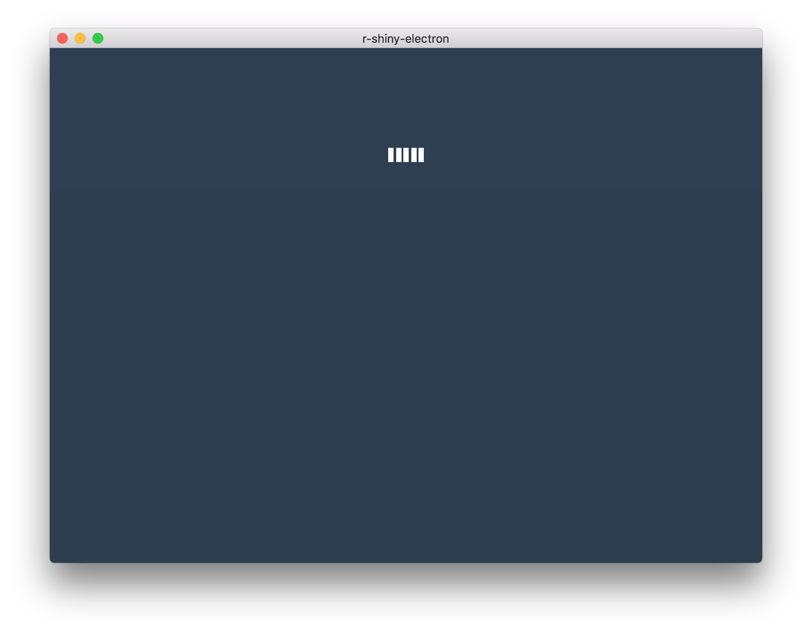
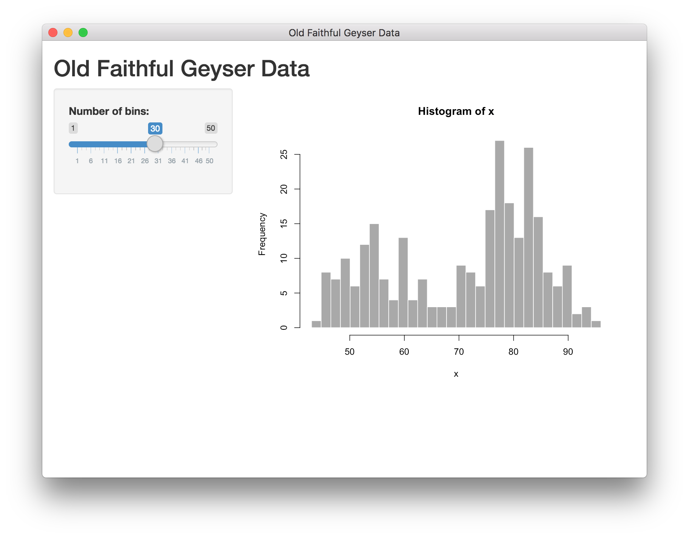

# Clinicopathological Data Analysis using R, shiny, and electron


https://zenodo.org/account/settings/github/repository/sbalci/clinicopathological

https://osf.io/4ukc6/


*See: *


https://sbalci.github.io/histopathology-template/


https://serdarbalci.gitbook.io/parapathology/computers/computers#deploying-a-shiny-app-as-a-desktop-application-with-electron


---


## set PYTHONPATH for npm

```text
npm config set python /usr/bin/python3
```

[https://www.npmjs.com/package/node-gyp](https://www.npmjs.com/package/node-gyp)

## [Deploying a Shiny app as a desktop application with Electron](https://www.travishinkelman.com/post/deploy-shiny-electron/)

* Read this [post](https://www.travishinkelman.com/post/deploy-shiny-electron/)
* Clone this repository [R Shiny Electron \(RSE\) template](https://github.com/dirkschumacher/r-shiny-electron)
* install Electron

```text
npm install -g electron
```

* install Electron Forge

```text
npm install -g electron-forge
```

* open folder with terminal

```text
cd r-shiny-electron-master
```

* npm install

```text
npm install
```

* install local R

update R version in `get-r-mac.sh` file

```text
./get-r-mac.sh
```

* install packages

```text
Rscript add-cran-binary-pkgs.R
```

* run app

```text
npm start
```

* make package

```text
electron-forge package
```

* make portable app

```text
electron-forge make
```


---


# R shiny and electron

This is a work in progress template for R shiny and electron integration

_NOT FOR PRODUCTION_

## Quickstart

* Clone
* `npm install`
* Download mac binaries `./get-r-mac.sh`
* Download shiny `Rscript add-cran-binary-pkgs.R`
* `npm start`

## Contribute

If you like to contribute, please take a look at the issues. It is all work in progress and early stage but ideas and code is always welcome. Ideally please make an issue before you send a larger PR.

## App

The app currently starts with a loading screen while trying to start the shiny app as a seperate process. If successful, it will switch to the shiny app once it is loaded. If not successful after 3 trys and error is shown.

Loading:


App:



## References

* The initial javascript template is based on the template from `electron-forge`
* This project is inspired by the work of [@ksasso](https://github.com/ksasso/useR_electron_meet_shiny)
